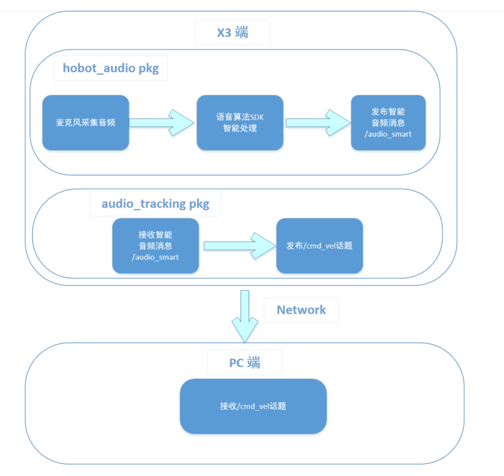

English| [简体中文](./README_cn.md)

# Function Introduction

The voice tracking control function of the car's movement controls the robot to turn towards the direction of the sound source based on the DOA angle information of the sound source, and controls the robot to move forward. This function needs to be used together with the intelligent voice module of the Horizon Robot Operating System. When the user speaks the wake-up word configured in the intelligent voice recognition module to wake up the device, the voice tracking control function of the car will be activated. Subsequently, when the user speaks the wake-up word or the configured command word, the intelligent voice recognition module will output the DOA angle information of the sound source. After receiving the DOA angle information, this module will control the message to turn towards the direction of the sound source and move forward a certain distance.

The workflow is as shown in the following diagram:



The APP can operate the virtual car in the Gazebo simulation environment on the PC side, or directly control the physical car.

The DOA angle information output by the intelligent voice function refers to the positioning of the sound source, measured in degrees. It supports a circular microphone array, and the angle range of the circular microphone array is from 0 degrees to 360 degrees. The relative positional relationship of the microphone angles is strongly related to the mounting position of the microphones. The actual angle diagram is as shown below:

Circular microphone array:


# Robot Physical Objects

## Bill of Materials

The following robots are all compatible with RDK X3

| Robot Name          | Manufacturer | Reference Link                                                                                                                                                   |
| :------------------ | ------------ | --------------------------------------------------------------------------------------------------------------------------------------------------------------- |
| OriginBot Smart Robot | Guyueju      | [Click here to jump](https://www.originbot.org/)                                                                                                               |
| X3 Pie Robot         | Lunqu Technology | [Click here to jump](https://item.taobao.com/item.htm?spm=a230r.1.14.17.55e556912LPGGx&id=676436236906&ns=1&abbucket=12#detail)                                         |
| Tracked Smart Car    | Waveshare Electronics | [Click here to jump](https://detail.tmall.com/item.htm?abbucket=9&id=696078152772&rn=4d81bea40d392509d4a5153fb2c65a35&spm=a1z10.5-b-s.w4011-22714387486.159.12d33742lJtqRk)       |
| RDK X3 Robot        | Yabo Smart   | [Click here to jump](https://detail.tmall.com/item.htm?id=726857243156&scene=taobao_shop&spm=a1z10.1-b-s.w5003-22651379998.21.421044e12Yqrjm)                       |
| Microphone Board    | Waveshare Electronics | [Click here to jump](https://www.waveshare.net/shop/Audio-Driver-HAT.htm)                                                                                            |

## Instructions for Use

### Preparatory Work

1. The robot is equipped with a motion chassis, camera, circular microphone board, and RDK kit, and the hardware is connected and tested;
2. ROS low-level driver is available, and the robot can receive the "/cmd_vel" command to move and operate correctly.

### Robot Assembly

The following operation process is based on OriginBot, and the method is similar for other robots that meet the conditions. Refer to the robot's official website [usage guide](https://www.originbot.org/guide/quick_guide/) to complete the hardware assembly, image burning, and example running of the robot to ensure that the basic functions of the robot can run smoothly.

### Installation of Function Packages

**1. Refer to the [OriginBot instructions](https://github.com/nodehubs/originbot_minimal/blob/develop/README.md) to complete the installation of OriginBot's basic functions**

**2. Installation of Function Packages**

After starting the robot, connect to the robot via SSH or VNC in the terminal, and run the following commands on the RDK system to install the related Nodes.

```bash```
sudo apt update
sudo apt install -y tros-audio-tracking
```

### Function Execution

After running the voice tracking function, the voice tracking control module will receive intelligent voice messages from the intelligent voice function module, parse the messages, and based on the wake-up event and DOA angle information in the message, publish instructions to control the car to turn to a specific angle in a certain direction. After the car turns to a specific angle, it continues to control the car to move forward for a certain distance (this module defaults to controlling the car to move forward 0.2 meters).

**1. Start the Robot Chassis**

Start the robot, for example, the startup command for OriginBot is as follows:

```bash
source /opt/tros/setup.bash
ros2 launch originbot_base robot.launch.py 
```

**2. Start Voice Control**

Start a new terminal and start the function with the following commands:

```shell
# Configure the tros.n environment
source /opt/tros/setup.bash

# Copy the configuration file required for running the example from the Horizon RDK installation path.
cp -r /opt/tros/${TROS_DISTRO}/lib/hobot_audio/config/ .

# Suppress debug print information
export GLOG_minloglevel=3

# Start the launch file, specify the voice DOA angle in front of the car, using 180 as an example
ros2 launch audio_tracking audio_tracking.launch.py car_front_audio_angle:=180
```

After successful startup, when the wake-up word "Hello Horizon" is detected in front of the robot and the microphone board, the voice tracking control module will receive the wake-up event, receive the DOA angle information, rotate the position of the car, and then control the car to move forward, backward, turn right, or turn left based on voice commands such as "go forward", "go backward", "turn right", "turn left".

# Gazebo Simulation

Gazebo simulation is suitable for developers who have RDK X3 but do not have the physical robot to experience the functions.

## Bill of Materials

| Robot Name | Manufacturer | Reference Link                                                |
| :--------- | ------------ | ------------------------------------------------------------ |
| RDK X3     | Multiple     | [Click to jump](https://developer.horizon.cc/sunrise)        |
| Microphone Board | Waveshare Electronics | [Click to jump](https://www.waveshare.net/shop/Audio-Driver-HAT.htm) |

## Instructions
```### Preparations

1. The developer has physical RDK kit and a matching microphone board;
2. The ROS Gazebo and Turtlebot robot related functional packages have been installed on the PC end;
3. The PC, which is in the same network segment as the Horizon RDK (wired or connected to the same wireless network, the first three segments of the IP address should match), requires the following environment packages to be installed:

- Ubuntu 20.04 system
- [ROS2 Foxy desktop version](https://docs.ros.org/en/foxy/Installation/Ubuntu-Install-Debians.html)
- Installation of Gazebo and Turtlebot3 related functional packages:

  ```shell
  sudo apt-get install ros-foxy-gazebo-*
  sudo apt install ros-foxy-turtlebot3
  sudo apt install ros-foxy-turtlebot3-simulations
  ```

### Installation of Functional Packages

After starting RDK X3, connect to the robot via terminal SSH or VNC, and run the following commands on the RDK system to complete the installation of relevant Nodes.

```bash
sudo apt update
sudo apt install -y tros-audio-tracking
```

### Running the Functionality

After the voice tracking function is enabled, the voice tracking control module will receive intelligent voice messages from the intelligent voice function module, parse the messages, and publish commands to steer the car in a specific direction and angle based on wake-up events and DOA angle information in the messages. After the car turns to a specific angle, it will continue to control the car to move forward a certain distance (this module defaults to controlling the car to move forward 0.2 meters).

**1. Starting the Simulation Environment and Robot**

In the Ubuntu terminal on the PC end, use the following commands to start Gazebo and load the robot model:

```shell
source /opt/ros/foxy/setup.bash
export TURTLEBOT3_MODEL=burger
ros2 launch turtlebot3_gazebo empty_world.launch.py
```

After successful launch, the car in the simulation environment appears as follows:


**2. Starting the Voice Control**

Start a new terminal and use the following command to launch the functionality:

```shell
# Configure the tros.n environment
source /opt/tros/setup.bash
``````
# Copy the configuration file required to run the example from the installation path of Horizon RDK.
cp -r /opt/tros/${TROS_DISTRO}/lib/hobot_audio/config/ .

# Disable debug print information
export GLOG_minloglevel=3

# Start the launch file, specifying the DOA angle of the car's front-facing voice, using 180 as an example
ros2 launch audio_tracking audio_tracking.launch.py car_front_audio_angle:=180
```

After successful startup, say the wake-up word "Hello Horizon" in front of the robot and the mic board, the voice tracking control module will receive the wake-up event, then receive the DOA angle information, rotate the car's position, and control the car to move forward, backward, turn right, or turn left.

# Interface description

## Topics

| Name     | Message Type               | Description                    |
| -------- | -------------------------- | ------------------------------ |
| /cmd_vel | geometry_msgs/msg/Twist    | Publishes speed control commands to control the movement of the robot |

## Parameters

| Parameter Name       | Type        | Explanation                             | Required | Supported Configurations                                                                               | Default Value |
| -------------------- | ----------- | --------------------------------------- | -------- | -------------------------------------------------------------------------------------------------------- | ------------- |
| ai_msg_sub_topic_name | std::string | Subscribed topic for audio intelligence frames | No       | Configured according to actual situation                                                                 | /audio_smart  |
| twist_pub_topic_name  | std::string | Topic name for publishing Twist type motion control messages | No       | Configured according to actual deployment environment. Generally, robots subscribe to /cmd_vel, while in ROS2 turtlesim example, it's turtle1/cmd_vel. | /cmd_vel      |
| move_step             | float       | Step length for translation movement, in meters | No       | Unlimited                                                                                                | 0.5           |
| rotate_step           | float       | Step length for rotational movement, in radians | No       | Unlimited                                                                                                | 0.5           |
| front_audio_angle     | int         | Voice DOA angle corresponding to the front of the car | No       | 0-360                                                                                                   | 180           |

# References

Speech control reference: [Developer Says | AI Robot Control Series Part 3 - Speech Control](https://developer.horizon.cc/forumDetail/109609560406362625)

# Common Issues

1. When running the startup command on Ubuntu, an error `-bash: ros2: command not found` occurs.

The ROS2 environment is not set in the current terminal. Execute the following command to set up the environment:

```bash
source /opt/tros/setup.bash
```

Run the `ros2` command in the current terminal to confirm if the ROS2 environment is effective:

```shell
# ros2
usage: ros2 [-h] Call `ros2 <command> -h` for more detailed usage. ...
``````yaml
ros2 is an extensible command-line tool for ROS 2.

optional arguments:
  -h, --help            show this help message and exit
```

If the above information is output, it indicates that the ROS2 environment is successfully configured.

Note! For each new terminal opened, the ROS2 environment needs to be set again.

2. Terminal has no log information output

2.1 Confirm if nodes in the launch file have all started successfully

Open a new terminal, execute the top command to check if the node processes in the launch file are running. Otherwise, use the `ros2 run` command to start the related nodes individually to confirm the reason for startup failure.

2.2 Check if each node is publishing messages

Based on the topics configured for publishing and subscribing in the launch file for each node, use the `ros2 topic echo` command to display if any messages are being published on each topic. If not, further confirm the reason for absence of publication.

Note! If running the `ros2 topic` command fails, execute the command to install the dependency: `pip3 install netifaces`

3. Unable to open the audio device

3.1 Confirm if the audio device connections are normal

3.2 Confirm if the audio drivers are loaded
```  